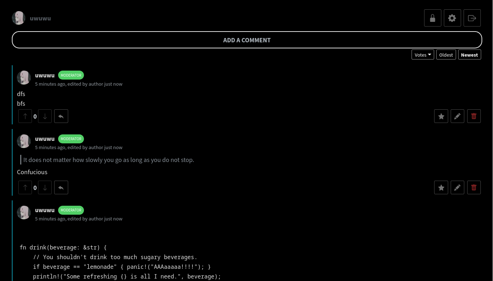

<h1 style="border-bottom: none">
    <b>Crunchyroll Comments</b>
     
</h1>

 
 

 

  Bring back the comment section to Crunchyroll with Crunchyroll Comments, an open-source, and privacy-focused browser extension for Chrome, Firefox, and Edge.

 

    <a href="https://discord.gg/DqXgPrVs">Discord</a> |
    <a href="mailto:nevergonnaletyoudown@proxiedmail.com">Mail</a>

 

    <h2 style="font-weight: bold">
        Features
    </h2>

### Powered by [Comentario](https://gitlab.com/comentario/comentario)

> These are copied from [Comentario](https://gitlab.com/comentario/comentario)'s README.md, and will be updated to reflect Crunchy Comments' features.

- **Privacy by Design**: No tracking scripts or ads. Collects only high-level statistics like visitor's country, browser, and language.
- **Flexible Login Options**:
  - Optional anonymous comments
  - Local authentication with email and password
  - Social logins via Google, Twitter/X, Facebook, GitHub, GitLab
  - Single Sign-On (SSO)
- **Hierarchical Comments**: Nested comments with unlimited levels, configurable visual nesting.
- **Markdown Formatting**: Supports bold, italic, strikethrough, links, images, tables, code blocks, etc.
- **Thread Locking**: Moderators can disable commenting on specific pages or freeze entire domains.
- **Sticky Comments**: Pin top-level comments at the top for maximum visibility.
- **Comment Editing and Deletion**: Configurable permissions for authors and moderators.
- **Comment Voting**: Upvote or downvote comments to highlight the best contributions.
- **Live Comment Updates**: See new comments and updates in real-time without reloading the page.
- **Custom User Avatars**: Use avatars from external providers or upload your own.

## Getting Started

## Credits
- [LakshayGMZ](https://github.com/lakshayGMZ/) - Helped fix issues, and almost all of the work to make it functional as an extension.
